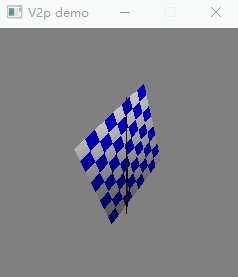
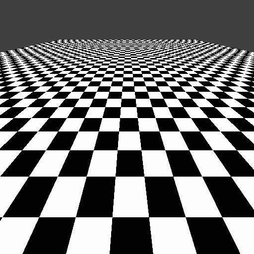
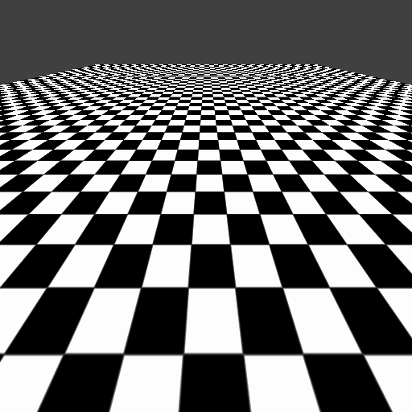
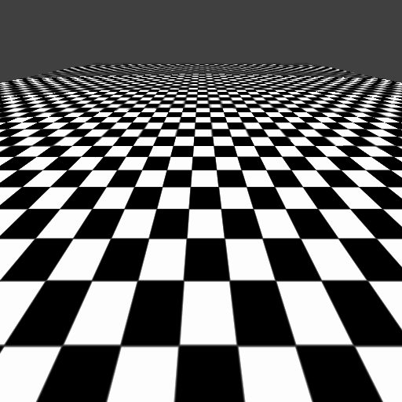

# Vec2pix

一个简易实时软件3D引擎。先实现一个简单的固定渲染管线。~~以后会考虑支持可编程渲染管线。~~ （没怎么用过图形引擎也不晓得该怎么设计）。

## Visualization

### 基本

使用控制台绘制：`#define DRAW_ON_CONSOLE`

使用GDI绘制：`#define DRAW_ON_GDI`

### 纹理过滤

**Nearest**

**Bilinear**

**Trilinear**

